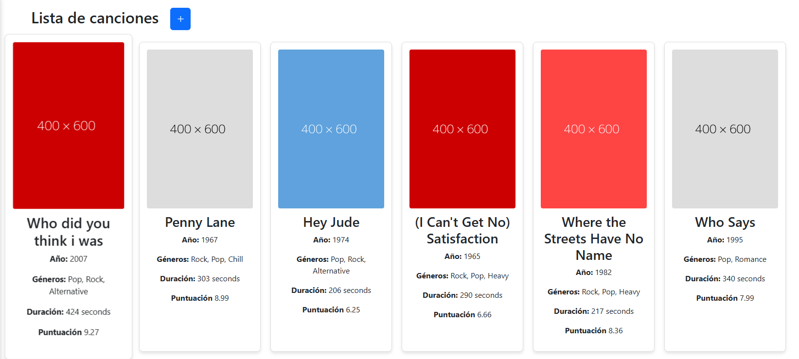
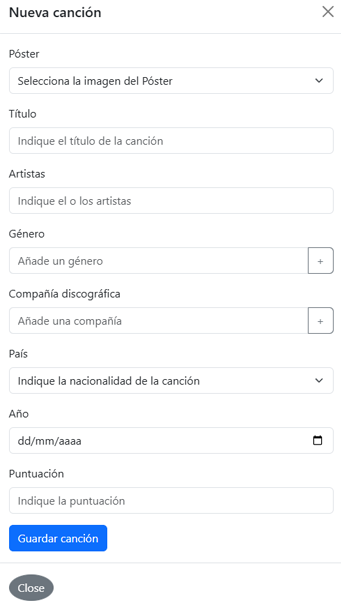
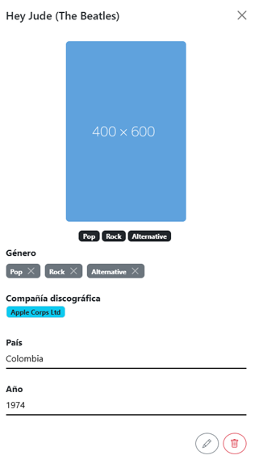
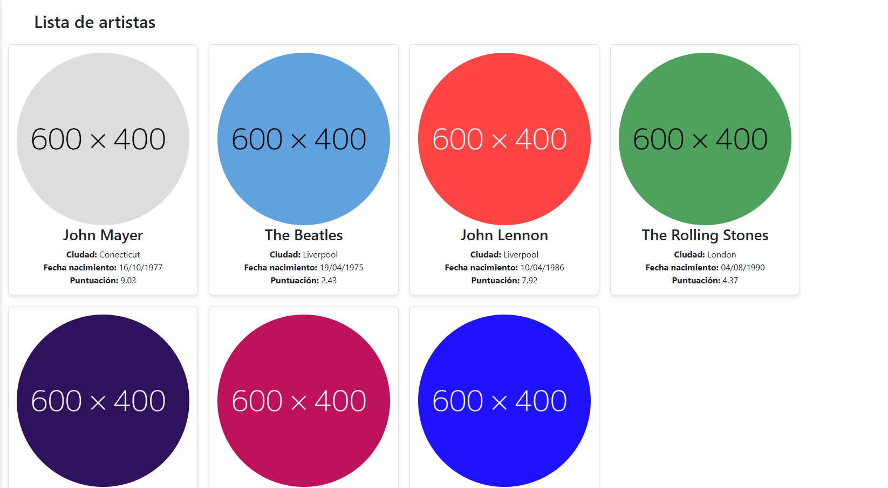
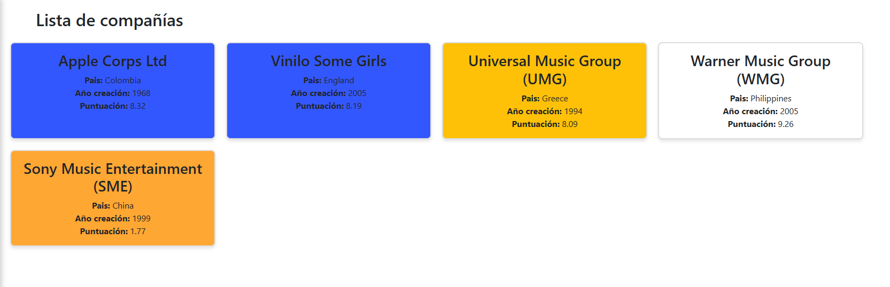
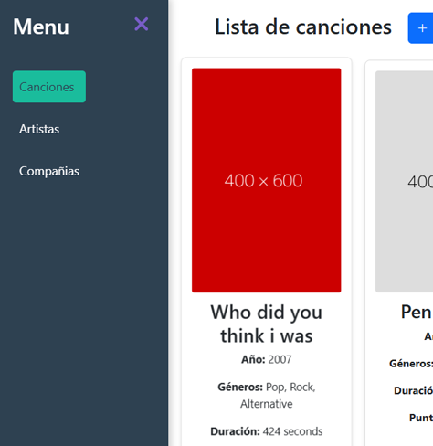

# testAngular
 Simulación web de música en Angular

 ## Características principales del frontend 👁‍🗨

- Componentes
    
    - Canciones

        Lista de canciones donde podemos ver un resumen de los datos de cada canción como el título, género, duración y puntuación de la canción.

        

        - Modal añadir canción

        
            
        - Modal editar canción
        
        

    - Artistas

        Lista de artistas donde podemos ver un resumen de sus datos como el nombre del artista, la imagen, la puntuación y sus canciones.

        

    - Compañias discográficas

        Lista de las compañías discográficas donde podemos ver un resumen de los datos como el nombre, país, año de creación o puntuación.

        

    - Sidebar

        